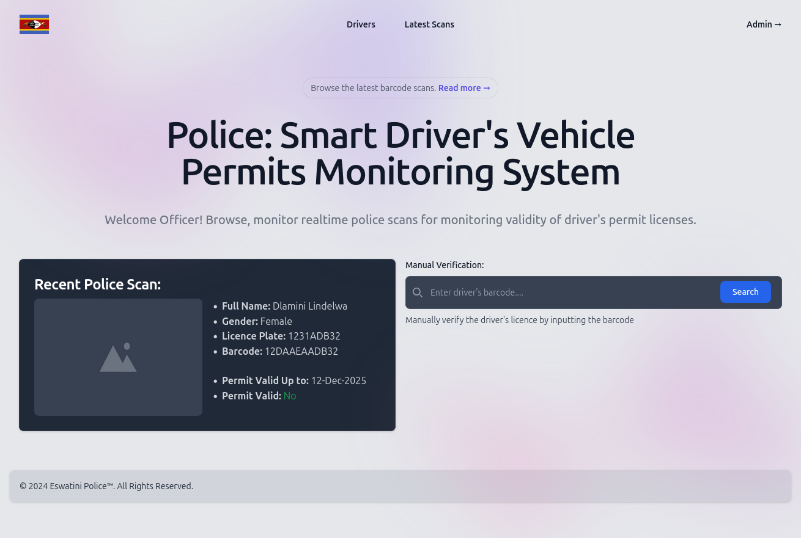

# Police: Driver's vehicle permit validator

Tool to be used by law enforcement to validate drivers' vehicle permits.



## Features 

- Can add drivers through UI
- Can scan driver's vehicle barcode to verify permit 

### Project Requirements & Setup

- Python 3.12
- Django (server backend)
- DjangoRestFramework (APIs)
- Arduino/ESP32/C++ (micro-controller)

# How to install and Run application

Follow this guide to install and run the application

#### Backend Set-up

```shell
$ git clone https://github.com/LindelwaSfiso/esp32_permit_validator.git
$ cd server
$ python -3.12 -m venv venv
$ venv\scripts\activate
$ (venv) pip install -r requirements.txt
$ (venv) manage.py migrate
$ (venv) manage.py runserver
```


### Backend css files setup

```shell
$ cd server
$ npm run build # generates build CSS for the website
```

### Creating administration account

```shell
$ cd ewscsla
$ venv\scripts\activate
$ (venv) manage.py createsuperuser
```

### ESP32 Set-up

Follow this guide to install and set-up the esp32 devtools:
https://docs.espressif.com/projects/arduino-esp32/en/latest/installing.html


# References

1. https://iotprojectsideas.com/qr-code-scanner-with-esp32-cam-module-opencv/
